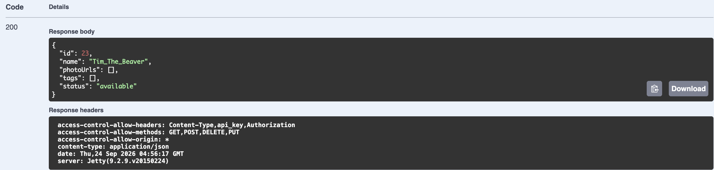

a) application/json

b) "json"

c) teapot

d) In Task 4, the server did not have the pet with the ID, so when asked to get it, the server could not find it and gave a 404. Between Task 4 and 6, the pet with the ID was added, so in Task 6, when asked to get it, the server found it and gave a 200 Success along with the information.

e) 